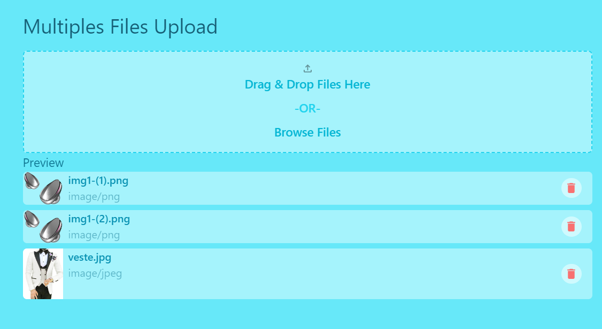

## Multiples Files Upload

## Application Url
If you want to see the demo of this app, check it there [Multiples Files Upload](https://expense-tracker-c4km.onrender.com/) 😁

## Description
Multiples Files Upload is an app that lets you upload multiples files to distant and help you to manage it.
You can upload, one or more images using, select file or Drag & Drop; you can delete images, and the file will be deleted from it distant database.
The app is easy to use and designed to facilitate files management.

## Technologies used
For this projet we used several technology :
- HTML : For markup language
- CSS : For styling
- Javascript:  For Interactivity part
- ... etc

### Framework
- [Vuejs](https://vuejs.org) : The Progressive JavaScript Framework
- [Nuxt](https://nuxt.com) : The Intuitive Vue Framework
- [Vueuse](https://vueuse.org/) : Collection of Vue Composition Utilities
## Features
With this application, you can, upload one or multiples images; delete images and have auto refresh from distant database.

## Screenshots

### Follow me
You can learn more, by contact me on [X](https://twitter.com/MbounaU)(Aka Twitter) or on [LinkedIn](https://www.linkedin.com/in/ulrich-mbouna/). Thanks
